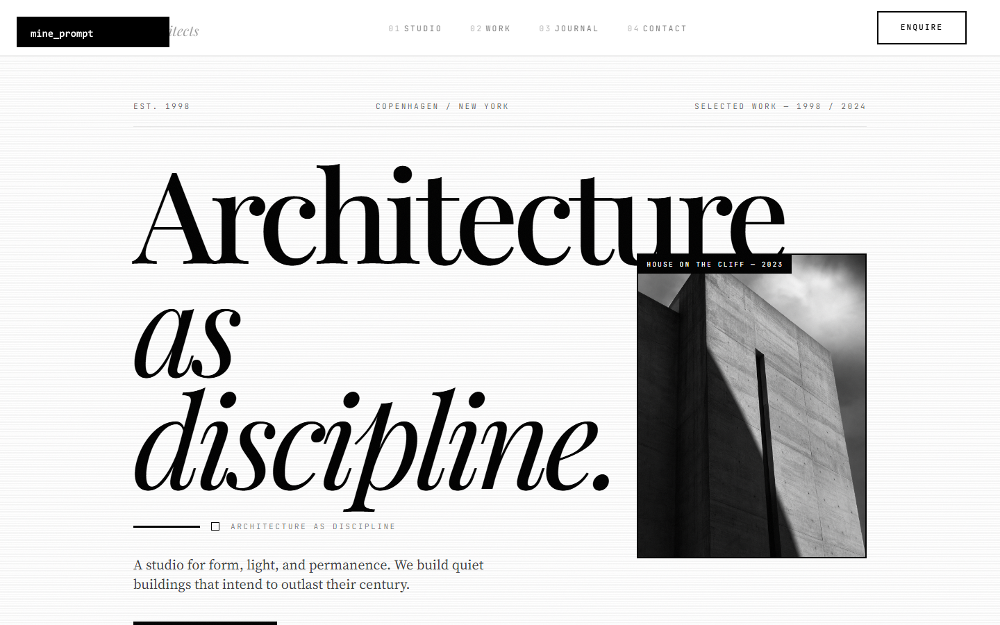
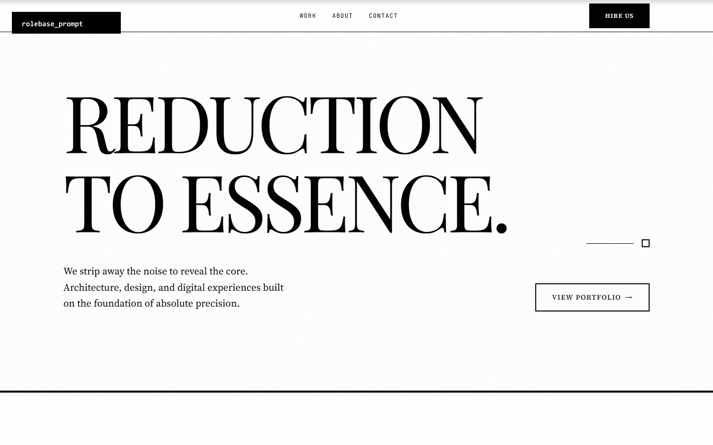
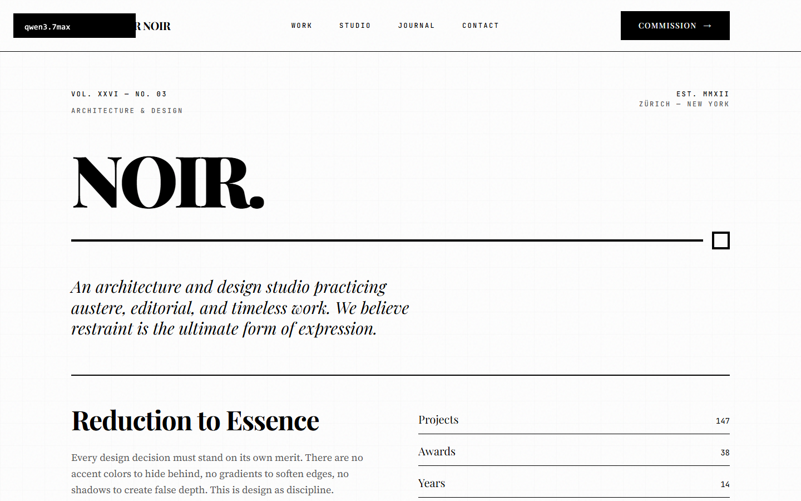

# One-Shot Prompt Based — Minimalist Monochrome Website Templates

Four React + Vite websites generated from different one-shot AI prompt strategies, all built in a **Minimalist Monochrome** design language: pure black and white, oversized serif typography, sharp corners, and editorial layouts.

Each folder is a self-contained project with its own dependencies and dev server.

## Live demos

| Site | Live URL |
|------|----------|
| mine_prompt | https://oneshot-mine-prompt.surge.sh |
| rolebase_prompt | https://oneshot-rolebase-prompt.surge.sh |
| qwen3.7max | https://oneshot-qwen37max.surge.sh |
| gemini3.1 pro | https://oneshot-gemini31-pro.surge.sh |

---

## Deploy to Surge

All four sites can be published to Surge.sh with one command from the repo root:

```bash
node scripts/deploy-surge.mjs
```

Build only (no deploy):

```bash
node scripts/deploy-surge.mjs --build-only
```

Deploy only (after builds exist):

```bash
node scripts/deploy-surge.mjs --deploy-only
```

### Surge authentication

The deploy script **does not** prompt for login. If you are not authenticated, it exits immediately with instructions.

**Option A — login in your own Windows terminal** (PowerShell or CMD, not Cursor's integrated shell):

```powershell
npm install -g surge
surge login
surge whoami
cd C:\Users\ninja\OneDrive\Documents\projects\preview_templates
node scripts/deploy-surge.mjs --deploy-only
```

**Option B — token for non-interactive deploy** (CI or scripted deploys):

```powershell
surge login          # once, in external terminal
surge token          # copy the token it prints
$env:SURGE_LOGIN = "your@email.com"
$env:SURGE_TOKEN = "your-token-here"
node scripts/deploy-surge.mjs --deploy-only
```

Expected domains:

- `oneshot-mine-prompt.surge.sh`
- `oneshot-rolebase-prompt.surge.sh`
- `oneshot-qwen37max.surge.sh`
- `oneshot-gemini31-pro.surge.sh`

---

## mine_prompt



Multi-page architecture studio site (**MERIDIAN Architects**) with routing across studio, portfolio, journal, and contact pages. Includes filterable work grid, project detail views, and a full editorial journal.

**Stack:** React 18 · Vite · Tailwind CSS v3 · React Router · lucide-react

```bash
cd mine_prompt
npm install
npm run dev
```

Runs at **http://localhost:5173**

---

## rolebase_prompt



Single-page minimalist studio site (**STUDIO.**) with hero, philosophy, expertise cards, stats, pricing tiers, and a contact form. Built with a role-based prompt approach.

**Stack:** React 19 · Vite 8 · Tailwind CSS v3 (PostCSS) · Google Fonts

```bash
cd rolebase_prompt/monochrome-site
npm install
npm run dev
```

Runs at **http://localhost:5174** (or the next available port)

---

## qwen3.7max



Single-page editorial site (**ATELIER NOIR**) with fixed navigation, showcase sections, commerce blocks, and support content. Responsive hamburger menu on mobile.

**Stack:** React 19 · Vite 7 · Tailwind CSS v4 (`@tailwindcss/vite`) · lucide-react

```bash
cd qwen3.7max
npm install
npm run dev
```

Runs at **http://localhost:5175** (or the next available port)

---

## gemini3.1 pro


Interactive architectural monograph (**AUSTERE**) with oversized hero typography, product detail, process timeline, blog gallery, testimonials, pricing, and modal-driven interactions throughout.

**Stack:** React 19 · Vite 7 · Tailwind CSS v4 (`@tailwindcss/vite`) · lucide-react

```bash
cd "gemini3.1 pro"
npm install
npm run dev
```

Runs at **http://localhost:5176** (or the next available port)

---

## Regenerating preview images

Preview screenshots with folder-name badges can be regenerated after starting all four dev servers:

```bash
cd scripts
npm install
npx playwright install chromium
node capture-previews.mjs
```

---

## License

These templates are provided as-is for preview and experimentation.
